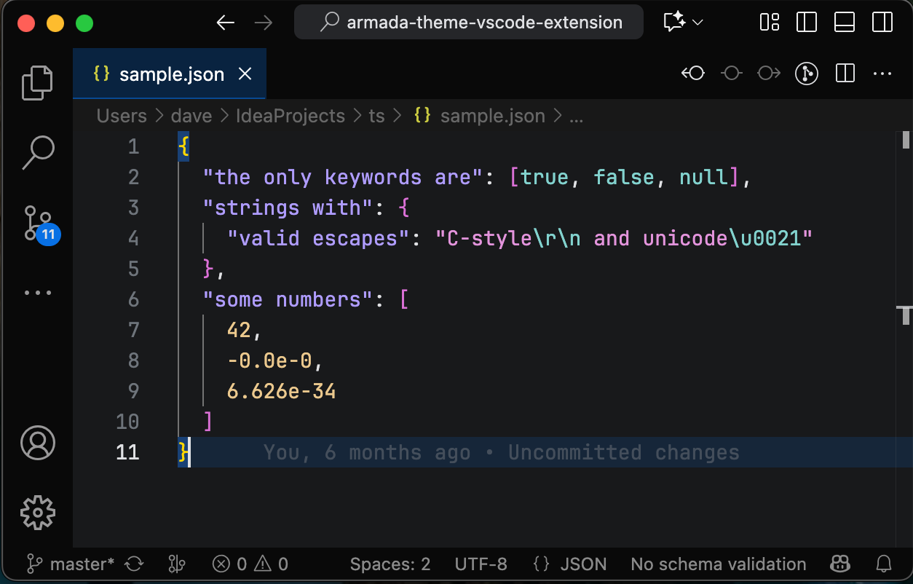

## Armada Theme for VS Code

Armada is a theme initially developed for [Tachi Code](https://tachicode.com) adapted from the dark theme from JetBrains Fleet.

Tachi Code borrows VS Code's theme system, so repackaging this theme for VS Code is relatively low effort.

### Screenshots 

### Other Armada  Implementations

- [Tachi Code](https://tachicode.com)
- [JetBrains IDEs](https://plugins.jetbrains.com/plugin/26844-armada-theme)